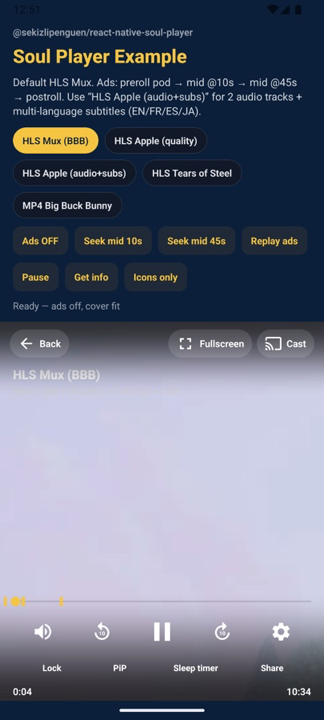
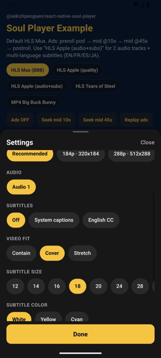
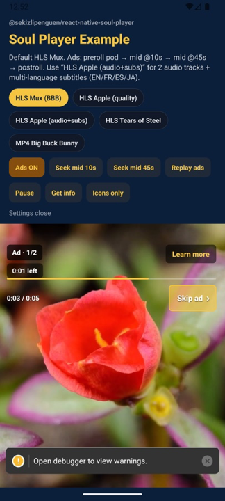
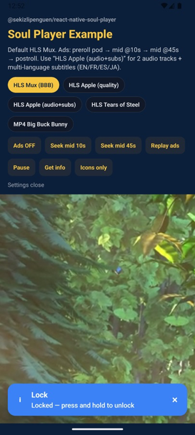
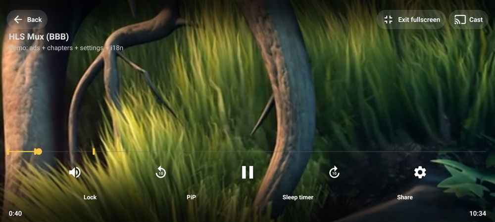

[](https://www.npmjs.com/package/@sekizlipenguen/react-native-soul-player)
[](https://www.npmjs.com/package/@sekizlipenguen/react-native-soul-player)
[](#license)

# @sekizlipenguen/react-native-soul-player

**Ship a YouTube-class video experience in React Native — without rebuilding the player from scratch.**

Soul Player is a free, highly configurable **video UI layer** on [`react-native-video`](https://github.com/TheWidlarzGroup/react-native-video): soft vignette chrome, gestures, HLS quality, audio/subtitles, declarative ads, immersive fullscreen, Chromecast / AirPlay, PiP, lock, sleep timer, chapters, end screen, and **20+ languages** out of the box.

> Use it in your apps. Source redistribution as a competing library is not allowed (`UNLICENSED`).

---

## Screenshots

| Player chrome | Settings | Ads |
| :---: | :---: | :---: |
|  |  |  |

| Lock | Immersive fullscreen |
| :---: | :---: |
|  |  |

---

## Why Soul Player?

| Pain | Soul Player |
|------|-------------|
| Bare `react-native-video` has no product UI | Full chrome, gestures, settings, ads |
| Building YouTube gestures takes weeks | Double-tap seek, hold-to-speed, swipe volume / brightness (built-in `SoulBrightnessModule`) |
| Ads + skip rules are messy | Declarative preroll / midroll / postroll, pod, waterfall, VAST |
| i18n is an afterthought | `locale="auto"` + TR/EN + 20+ packs |
| Fullscreen breaks on Android | Immersive Modal + orientation + sticky system bars |
| Settings UX is ugly | Sheet + `@sekizlipenguen/react-native-scroll-menu` chips |

**Perfect for:** OTT / VOD, news, education, sports, in-app ads, Turkish & multi-locale apps.

---

## Installation

```bash
yarn add @sekizlipenguen/react-native-soul-player react-native-video
yarn add react-native-safe-area-context react-native-screens
cd ios && pod install
```

Bundled with the package (`dependencies`, `^`):  
`@sekizlipenguen/react-native-popup-confirm-toast` · `@sekizlipenguen/react-native-scroll-menu` · `@react-native-community/slider`

### Quick start

```tsx
import {SafeAreaProvider} from 'react-native-safe-area-context';
import {Root} from '@sekizlipenguen/react-native-popup-confirm-toast';
import SoulPlayer from '@sekizlipenguen/react-native-soul-player';

export default function App() {
  return (
    <SafeAreaProvider>
      <Root>
        <SoulPlayer
          videoUrl="https://test-streams.mux.dev/x36xhzz/x36xhzz.m3u8"
          videoType="m3u8"
          title="My stream"
          locale="auto"
          showBackButton
          resizeMode="cover"
          fullscreenMode="immersive"
          controls={{showLabels: true, doubleTapSeek: true, lock: true, pip: true}}
          theme={{accentColor: '#F5C542'}}
          style={{flex: 1}}
          videoProps={{
            ignoreSilentSwitch: 'ignore',
            source: {headers: {Authorization: 'Bearer …'}},
          }}
        />
      </Root>
    </SafeAreaProvider>
  );
}
```

**Android PiP** — on host `MainActivity`:

```xml
android:supportsPictureInPicture="true"
android:resizeableActivity="true"
```

---

## API overview

### Props

| Prop | Type | Description |
|------|------|-------------|
| `videoUrl` | `string` | **Required.** Stream / file URL |
| `videoType` | `string` | e.g. `m3u8`, `mp4` |
| `title` / `description` | `string` | Overlay metadata |
| `poster` | `string` | Poster image URL |
| `paused` | `boolean` | Controlled pause |
| `resizeMode` | `contain` \| `cover` \| `stretch` \| `none` | Video fit (also in settings) |
| `showBackButton` | `boolean` | Show back control |
| `showCastButton` | `boolean` | Show Cast / AirPlay |
| `theme` | `{ accentColor, trackColor, controlColor }` | Colors |
| `controls` | `SoulPlayerControls` | Toggle every UI / gesture (see below) |
| `labels` | `Partial<SoulPlayerLabels>` | String overrides |
| `locale` | `string` \| `'auto'` | i18n pack (`auto` = device) |
| `fullscreenMode` | `'immersive'` \| `'layout'` | Modal FS vs host layout |
| `enterFullscreenOnRotate` | `boolean` | Landscape → fullscreen |
| `exitFullscreenOnPortrait` | `boolean` | Portrait → exit FS |
| `textTracks` | `ExternalTextTrack[]` | Extra VTT / captions |
| `ads` | `SoulPlayerAds` | Opt-in ad breaks |
| `chapters` | `Chapter[]` | Markers on progress bar |
| `endScreenItems` | `array` | End-screen actions |
| `resumeTime` / `startTime` | `number` | Start / resume position (s) |
| `isLive` / `isOffline` | `boolean` | Live badge / offline chip |
| `preset` | `full` \| `minimal` \| `youtube` \| `tv` | Control presets |
| `holdRate` | `number` | Hold-to-speed rate |
| `style` | `ViewStyle` | Root style |
| `videoProps` | `object` | Raw `react-native-video` props (content only) |
| `renderTopBar` | `(ctx) => node` | Replace top chrome |
| `renderBottomBar` | `(ctx) => node` | Replace bottom chrome |
| `renderAdOverlay` | `(ctx) => node` | Custom ad UI |
| `renderEndScreen` | `(ctx) => node` | Custom end screen |
| `renderCompanion` | `(ctx) => node` | Companion ad slot |

### Features

| Feature | How |
|---------|-----|
| Soft vignette chrome | Top/bottom fades; readable on bright video |
| Auto-hide / tap restore | `controls.autoHide` + single-tap reveal |
| Icon + labels | `controls.showLabels` |
| Double-tap seek / play-pause | `controls.doubleTapSeek` / `doubleTapPlayPause` |
| Hold-to-speed | `controls.holdToSpeed` + `holdRate` |
| Swipe volume / brightness | `swipeVolume` / `swipeBrightness` (brightness via built-in `SoulBrightnessModule`) |
| HLS quality picker | Settings → Recommended + resolutions |
| Audio / subtitles | Settings chips + `textTracks` |
| Subtitle style | Size 12–32 · color · background |
| Video fit | contain / cover / stretch in settings |
| Ads | `ads.enabled` + breaks (preroll / mid / post, pod, waterfall, VAST) |
| Immersive fullscreen | `fullscreenMode="immersive"` |
| Chromecast / AirPlay | Cast button (Android / iOS) |
| PiP | `controls.pip` + host manifest |
| Control lock | Tap lock; unlock via lock overlay (no toast steal) |
| Sleep timer / share | `controls.sleepTimer` / `share` |
| Chapters / end screen | `chapters` / `endScreenItems` |
| i18n | `locale="auto"` + 20+ packs |
| Raw RN Video | `videoProps` (DRM, headers, buffer, …) |
| Programmatic chrome | `ref.showChrome()` / `ref.hideChrome()` |

### Host setup (required for fullscreen rotate)

Immersive fullscreen calls native `lockToLandscape` / `lockToPortrait`. The **host app** must allow landscape and return Soul Player’s orientation mask.

**1. Info.plist (iPhone)** — include landscape:

```xml
<key>UISupportedInterfaceOrientations</key>
<array>
  <string>UIInterfaceOrientationPortrait</string>
  <string>UIInterfaceOrientationLandscapeLeft</string>
  <string>UIInterfaceOrientationLandscapeRight</string>
</array>
```

**2. AppDelegate** — return `SoulPlayerGetOrientationMask()` (default portrait until FS locks landscape):

```swift
// Bridging header: #import "SoulOrientationModule.h"
func application(
  _ application: UIApplication,
  supportedInterfaceOrientationsFor window: UIWindow?
) -> UIInterfaceOrientationMask {
  return SoulPlayerGetOrientationMask()
}
```

See the example app: [`example/ios/SoulPlayerExample/AppDelegate.swift`](./example/ios/SoulPlayerExample/AppDelegate.swift).

**Android** — `SoulOrientationModule.setImmersiveMode` uses sticky immersive system bars. PiP needs `supportsPictureInPicture` on the host activity (see Quick start).

### `controls.*` (default: most on)

| Key | Description |
|-----|-------------|
| `showLabels` | Icon + text under controls |
| `autoHide` / `autoHideDelay` | Hide chrome after idle |
| `singleTapToggleControls` | Tap to show/hide |
| `doubleTapPlayPause` / `doubleTapSeek` | Double-tap gestures |
| `holdToSpeed` / `holdRate` | Hold for speed boost |
| `swipeVolume` / `swipeBrightness` | Edge swipes |
| `progress` / `tapToSeek` / `scrubbing` | Seek bar behavior |
| `currentTime` / `duration` | Time labels |
| `mute` / `rewind` / `playPause` / `forward` | Transport |
| `seekStep` | Rewind/forward seconds |
| `back` / `fullscreen` / `cast` / `settings` | Top actions |
| `lock` / `pip` / `sleepTimer` / `share` | Utility row |
| `audioTrackPicker` / `subtitlePicker` / `subtitleStyle` / `systemCaptions` | Settings media |
| `chapters` / `endScreen` / `titleOverlay` | Markers / end / title |
| `live` / `goToLive` / `next` / `previous` | Live & playlist |
| `debugOverlay` / `drmStatus` / `offlineBadge` | Dev / status chips |

### Callbacks

| Callback | When |
|----------|------|
| `onLoadStart` | Content load starts |
| `onLoad` | Metadata loaded (`duration`, …) |
| `onProgress` | Playback tick |
| `onProgressPersist` | Progress for resume storage |
| `onPlay` / `onPause` | Play / pause (`time`) |
| `onEnd` | Content finished |
| `onError` | Playback error |
| `onSeek` | Seek completed (`time`) |
| `onRewind` / `onForward` | ± seek controls |
| `onMuteToggle` | Mute changed |
| `onVolumeChange` | Volume changed |
| `onQualityChange` | HLS quality picked |
| `onAudioTrackChange` | Audio track picked |
| `onSubtitleChange` | Subtitle picked |
| `onFullScreen` | FS boolean changed |
| `onFullScreenEnter` / `onFullScreenExit` | FS enter / exit |
| `onSettingsOpen` / `onSettingsClose` | Settings sheet |
| `onControlsVisibilityChange` | Chrome show/hide |
| `onBackButton` | Back pressed |
| `onCastPress` | Cast button |
| `onCastStateChange` | Cast connected/disconnected |
| `onNext` / `onPrevious` | Playlist nav |
| `onShare` | Share (`?t=` query) |
| `onEndScreenAction` | End-screen item tapped |
| `onAdBreakStart` / `onAdBreakEnd` | Ad break lifecycle |
| `onAdSkip` / `onAdClick` / `onAdError` | Ad skip / CTA / error |

### Ref (`SoulPlayerRef`)

| Method | Description |
|--------|-------------|
| `seek(time)` | Seek to seconds |
| `enterFullscreen()` / `exitFullscreen()` | Toggle immersive FS |
| `showChrome()` / `hideChrome()` | Force chrome visible / hidden |
| `getInfo()` | `{ currentTime, duration, isFullscreen, isAdPlaying }` |
| `videoRef()` | Underlying `react-native-video` ref |

### `videoProps`

| Rule | Detail |
|------|--------|
| Pass-through | Any `react-native-video` prop (`drm`, `bufferConfig`, `ignoreSilentSwitch`, …) |
| `source` merge | `videoProps.source` under SoulPlayer `uri` / `type` / `textTracks` |
| SoulPlayer wins | `paused`, handlers, `controls={false}`, PiP from `controls` |
| Ads | Not applied during ad playback |

---

## Ads

Opt-in via `ads.enabled: true`.

```tsx
ads={{
  enabled: true,
  pod: true,
  vast: true,
  breaks: [
    {
      id: 'pre',
      position: 'preroll', // 'postroll' | 60 | '25%'
      creatives: [{url: 'https://example.com/ad1.mp4'}],
      skip: {mode: 'afterSeconds', value: 5},
      clickThroughUrl: 'https://example.com',
    },
  ],
}}
```

| Field | Description |
|-------|-------------|
| `position` | `preroll` · `postroll` · seconds · `'25%'` |
| `creatives[]` | Pod sequence |
| `urls[]` | Waterfall (fail → next) |
| `url` | Single creative |
| `skip` | `afterSeconds` · `afterPercent` · `never` · `false` |

---

## i18n

`locale="auto"` (default). Packs: `tr`, `en`, `es`, `de`, `fr`, `pt`, `pt-BR`, `ar`, `ru`, `zh-Hans`, `zh-Hant`, `ja`, `ko`, `hi`, `it`, `nl`, `pl`, `id`, `uk`, `vi`, `th`, `sv`, `he`.

```tsx
labels={{skipAd: 'Geç', lockedToast: 'Kilitlendi'}}
```

---

## Example app

RN **0.86.2** playground: [`example/`](./example/) · [`example/README.md`](./example/README.md)

```bash
cd example
yarn
yarn start --port 8081
yarn android   # or: yarn ios
```

Layout probe: player sits in a fixed **16:9** mid box with filler text below (isolates chrome/layout bugs from SafeArea / flex fill).

### Maestro E2E

Flows live under [`example/maestro/`](./example/maestro/) (`soul-e2e-ios.yaml`, `soul-e2e-android.yaml`). Screenshots go to **`/tmp/soul-player-maestro`** (not committed).

```bash
# device / simulator already booted + app installed + Metro running
maestro --device <deviceId> test example/maestro/soul-e2e-android.yaml
maestro --device <udid> test example/maestro/soul-e2e-ios.yaml
```

---

## Keywords

`react-native` · `react-native-video` · `video player` · `HLS` · `m3u8` · `ExoPlayer` · `AVPlayer` · `YouTube player UI` · `double tap seek` · `hold to speed` · `swipe volume` · `subtitle` · `closed captions` · `audio track` · `quality picker` · `adaptive bitrate` · `preroll` · `midroll` · `VAST` · `ad pod` · `Chromecast` · `AirPlay` · `PiP` · `picture in picture` · `fullscreen` · `immersive` · `i18n` · `Turkish` · `OTT` · `VOD` · `media player` · `soul-player`

Types: [`index.d.ts`](./index.d.ts).

---

## License

**Use-only.** You may integrate this package in your applications. Modification and republication of the source as an open fork / competing library are not permitted. See `package.json` (`UNLICENSED`).
